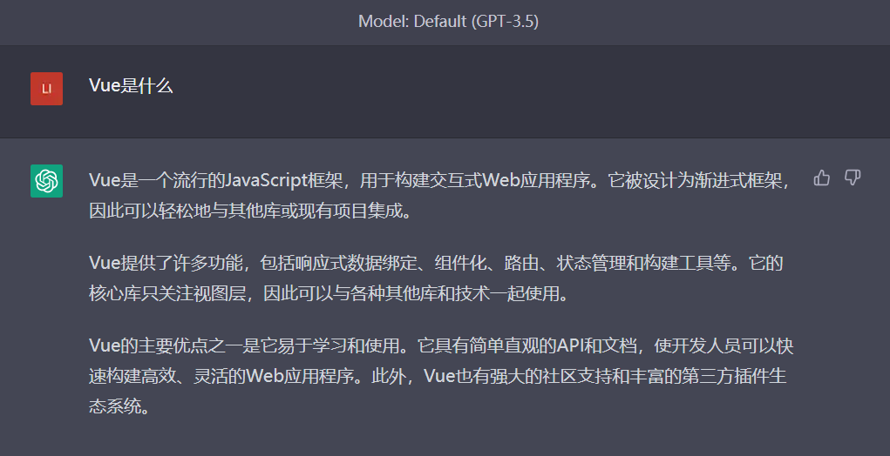
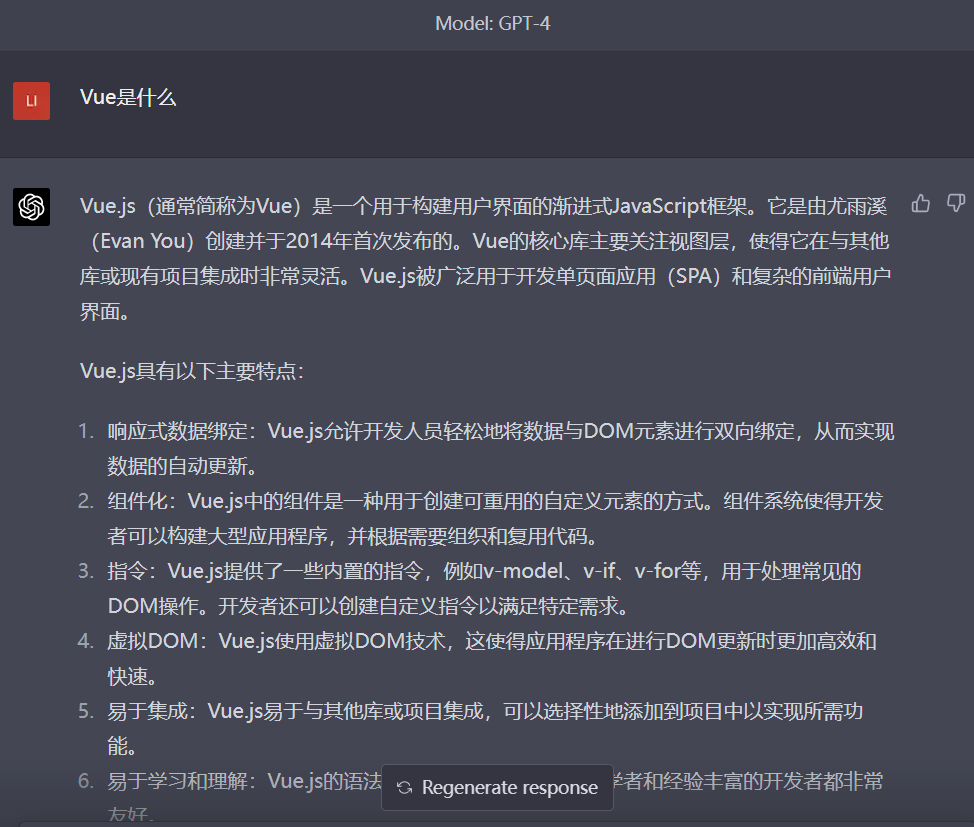
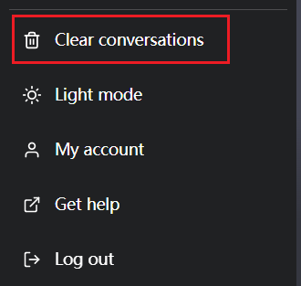

# 如何注册 ChatGPT 账号

视频教程：[【2023最新】注册 ChatGPT 账号！一次成功、ChatGPT 注册教程！在国内也可以轻松注册 ChatGPT 和 OpenAI｜数字牧民LC](https://www.youtube.com/watch?v=NWJeRBMpsx8&ab_channel=%E6%95%B0%E5%AD%97%E7%89%A7%E6%B0%91LC)

# 如何购买 ChatGPT plus

todo

# 各模型版本对比

GPT-3.5-turbo

回答速度快，但不够详细

GPT-4：

回答得更详细，但速度慢

# 官网使用

## :warning:别手残点 Clear conversation

 点 Clear conversations 会清理掉所有会话的历史对话记录！别以为是清理单个会话里的对话内容！

## 遇到 Something went wrong. 怎么办？

这是免费账户经常遇到的问题。通常发生在提问了一次后，间隔两三分钟不进行提问就会报错：

> Something went wrong. If this issue persists please contact us through our help center at [help.openai.com](http://help.openai.com/).

2023 年 4 月 16 日之前可以使用钞能力购买 ChatGPT plus 解决。

2023 年 4 月 16 日之后，即便是 ChatGPT plus 账户，访问官网时使用的 IP 如果不是独享 IP，依然会提示：

> Something went wrong. If this issue persists please contact us through our help center at [help.openai.com](http://help.openai.com/).

参考：[怎么开了 ChatGPT plus 还会出现 Something went wrong.？](https://www.v2ex.com/t/932930)

可以装个[油猴脚本](https://www.v2ex.com/t/926890)解决这个问题。

# API

## [API 支持的国家和地区](https://platform.openai.com/docs/supported-countries)

## 为什么调用 API 收到 response 的时间变长了？

2023 年 4 月 5 日左右，OpenAI 对未绑卡的账户进行了限制，收到 response 的延迟远高于已绑卡的账户。

点击[此处](https://platform.openai.com/account/billing/overview)绑卡可解决问题。

# ChatGPT 相关开源项目

[ChatGPT 话题](https://github.com/topics/chatgpt)

## [f/awesome-chatgpt-prompts](f/awesome-chatgpt-prompts) 

ChatGPT 英文使用指南

## [lencx/ChatGPT](https://github.com/lencx/ChatGPT)

适用于 Mac、Windows、Linux 系统的 ChatGPT 桌面应用

## [acheong08/ChatGPT](acheong08/ChatGPT)

ChatGPT API 逆向工程。用于实现聊天机器人。

## [PlexPt/awesome-chatgpt-prompts-zh](PlexPt/awesome-chatgpt-prompts-zh)

ChatGPT 中文使用指南

## [LAION-AI/Open-Assistant](https://github.com/LAION-AI/Open-Assistant)

对标 ChatGPT ，但训练数据开源，还没做出来

## [ml-tooling](https://github.com/ml-tooling)/**[best-of-ml-python](https://github.com/ml-tooling/best-of-ml-python)**

机器学习相关的项目排行榜，每周更新

## [wong2 ](https://github.com/wong2)/ [chatgpt-google-extension](https://github.com/wong2/chatgpt-google-extension)

搜索引擎侧边栏。已被收购，后续更新不再开源。

## [transitive-bullshit](https://github.com/transitive-bullshit)/**[chatgpt-api](https://github.com/transitive-bullshit/chatgpt-api)**

使用于官方ChatGPT API的Node.js客户端。

## [yetone ](https://github.com/yetone)/ [openai-translator](https://github.com/yetone/openai-translator)

基于 ChatGPT API 的划词翻译浏览器插件和跨平台桌面端应用

## [xx025](https://github.com/xx025)/**[carrot](https://github.com/xx025/carrot)**

免费或收费的提供 ChatGPT 服务的网站。

### [josStorer ](https://github.com/josStorer)/ [chatGPTBox](https://github.com/josStorer/chatGPTBox)

浏览器插件
