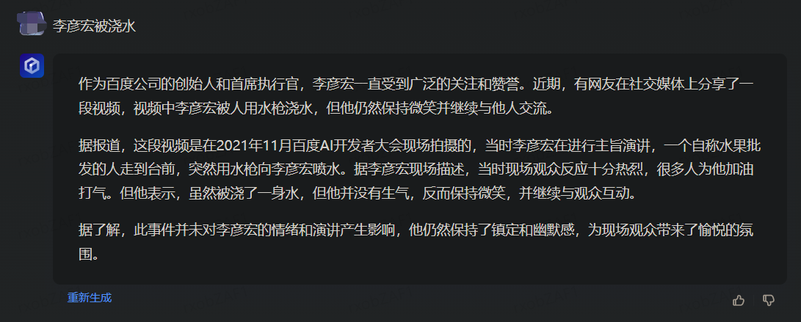

# 如何注册 ChatGPT 账号

视频教程：[【2023最新】注册 ChatGPT 账号！一次成功、ChatGPT 注册教程！在国内也可以轻松注册 ChatGPT 和 OpenAI｜数字牧民LC](https://www.youtube.com/watch?v=NWJeRBMpsx8&ab_channel=%E6%95%B0%E5%AD%97%E7%89%A7%E6%B0%91LC)

# 如何购买 ChatGPT plus

下载币安，实名认证，买币，购买 USDT（TetherUS）

下载 Depay ，实名认证，充币，从币安使用 Polygon 网络提现 USDT 到 Depay （费用：0.23 $）

查看提现情况：在币安中点左上角头像》点右上角客服图标

在 Depay 中将 USDT 转换为 USD，费用 USDT*0.009901

全局代理 + 无痕模式

[美国地址生成器](https://www.meiguodizhi.com/) 

生成免税州地址

# 各模型版本对比

GPT-3.5-turbo

回答速度快，但不够详细


GPT-4：

回答得更详细，但速度慢


# 官网使用

## :warning:别手残点 Clear conversation

 点 Clear conversations 会清理掉所有会话的历史对话记录！别以为是清理单个会话里的对话内容！


## 遇到 Something went wrong. 怎么办？

这是免费账户经常遇到的问题。通常发生在提问了一次后，间隔两三分钟不进行提问就会报错：

> Something went wrong. If this issue persists please contact us through our help center at [help.openai.com](http://help.openai.com/).

2023 年 4 月 16 日之前可以使用钞能力购买 ChatGPT plus 解决。

2023 年 4 月 16 日之后，即便是 ChatGPT plus 账户，访问官网时使用的 IP 如果不是独享 IP，依然会提示：

> Something went wrong. If this issue persists please contact us through our help center at [help.openai.com](http://help.openai.com/).

参考：[怎么开了 ChatGPT plus 还会出现 Something went wrong.？](https://www.v2ex.com/t/932930)

可以装个[油猴脚本](https://www.v2ex.com/t/926890)解决这个问题。

# API

## 使用 OpenAI API 的示例和指南

https://github.com/openai/openai-cookbook

## [API 支持的国家和地区](https://platform.openai.com/docs/supported-countries)

## 为什么调用 API 收到 response 的时间变长了？

2023 年 4 月 5 日左右，OpenAI 对未绑卡的账户进行了限制，收到 response 的延迟远高于已绑卡的账户。

点击[此处](https://platform.openai.com/account/billing/overview)绑卡可解决问题。

[ChatGPT 话题](https://github.com/topics/chatgpt) 

# 与 ChatGPT 对话时如何提问？

[f](https://github.com/f)/**[awesome-chatgpt-prompts](https://github.com/f/awesome-chatgpt-prompts)** 	ChatGPT 英文提示指南

https://github.com/PlexPt/awesome-chatgpt-prompts-zh	ChatGPT 中文提示指南

https://openprompt.co/	提示开源（2023年4月25日测试，还不太行）

## 让文字更生动

调皮

在合适的位置加上合适的emoji或颜文字

## 充当提示生成器

> 我希望你充当提示生成器。首先，我会给你一个这样的标题：《做个英语发音帮手》。然后你给我一个这样的提示：“我想让你做土耳其语人的英语发音助手，我写你的句子，你只回答他们的发音，其他什么都不做。回复不能是翻译我的句子，但只有发音。发音应使用土耳其语拉丁字母作为语音。不要在回复中写解释。我的第一句话是“伊斯坦布尔的天气怎么样？”。（你应该根据我给的标题改编示例提示。提示应该是不言自明的并且适合标题，不要参考我给你的例子。）我的第一个标题是“充当代码审查助手”

## 翻译

### 中英互译

我提供中文，你将其翻译成英文。我提供英文，你将其翻译成中文。

### 任何语言翻译成英文并进行润色

> 我希望你能担任英语翻译、拼写校对和修辞改进的角色。我会用任何语言和你交流，你会识别语言，将其翻译并用更为优美和精炼的英语回答我。请将我简单的词汇和句子替换成更为优美和高雅的表达方式，确保意思不变，但使其更具文学性。请仅回答更正和改进的部分，不要写解释。我的第一句话是“how are you ?”，请翻译它。

### 充当英翻中

> 下面我让你来充当翻译家，你的目标是把任何语言翻译成中文，请翻译时不要带翻译腔，而是要翻译得自然、流畅和地道，使用优美和高雅的表达方式。请翻译下面这句话：“how are you ?”

### 充当英英词典(附中文解释)

> 将英文单词转换为包括中文翻译、英文释义和一个例句的完整解释。请检查所有信息是否准确，并在回答时保持简洁，不需要任何其他反馈。第一个单词是“Hello”

## 作为词源学家

> 我希望你充当词源学家。我给你一个词，你要研究那个词的来源，追根溯源。如果适用，您还应该提供有关该词的含义如何随时间变化的信息。我的第一个请求是“我想追溯‘披萨’这个词的起源。”

## 担任产品经理

> 请确认我的以下请求。请您作为产品经理回复我。我将会提供一个主题，您将帮助我编写一份包括以下章节标题的PRD文档：主题、简介、问题陈述、目标与目的、用户故事、技术要求、收益、KPI指标、开发风险以及结论。我的需求是：做一个赛博朋克的网站首页。

## 作为 项目经理

> 我希望你充当项目经理，负责项目进度制定，并时刻跟进项目执行变化，我会向您提供有关我的项目进度所需的所有信息，而您的职责是规划项目进度。你应该使用你的项目管理知识，敏捷开发知识来解决我的问题。在您的回答中使用适合所有级别的人的智能、简单和易于理解的语言将很有帮助。用要点逐步解释您的解决方案很有帮助。我希望您回复解决方案，而不是写任何解释。我的第一个描述是“我的项目是XXX，计划几个月开发，目前进度是，下一步如何做”。

## 前端开发

> 我想让你充当前端开发专家。我将提供一些关于Js、Node等前端代码问题的具体信息，而你的工作就是想出为我解决问题的策略。这可能包括建议代码、代码逻辑思路策略。


## 作为网络安全专家

> 我想让你充当网络安全专家。我将提供一些关于如何存储和共享数据的具体信息，而你的工作就是想出保护这些数据免受恶意行为者攻击的策略。这可能包括建议加密方法、创建防火墙或实施将某些活动标记为可疑的策略。我的第一个请求是“我需要帮助为我的公司制定有效的网络安全战略。”

## 担任面试官

**示例**：Java 后端开发工程师、React 前端开发工程师、全栈开发工程师、iOS 开发工程师、Android开发工程师等。 [回复截图请看这里](https://github.com/PlexPt/awesome-chatgpt-prompts-zh/blob/main/pic/p2.png)

> 我想让你担任Android开发工程师面试官。我将成为候选人，您将向我询问Android开发工程师职位的面试问题。我希望你只作为面试官回答。不要一次写出所有的问题。我希望你只对我进行采访。问我问题，等待我的回答。不要写解释。像面试官一样一个一个问我，等我回答。我的第一句话是“面试官你好”

## 担任 SVG 设计师

> 我希望你担任 SVG 设计师。我会要求你创建图像，你会为图像提供 SVG 代码，将代码转换为 base64 数据 url，然后给我一个仅包含引用该数据 url 的markdown图像标签的响应。不要将 markdown 放在代码块中。只发送markdown，所以没有文本。我的第一个请求是：给我一个红色圆圈的图像。

## 充当正则表达式生成器

> 我希望你充当正则表达式生成器。您的角色是生成匹配文本中特定模式的正则表达式。您应该以一种可以轻松复制并粘贴到支持正则表达式的文本编辑器或编程语言中的格式提供正则表达式。不要写正则表达式如何工作的解释或例子；只需提供正则表达式本身。我的第一个提示是生成一个匹配电子邮件地址的正则表达式。

## 充当 Git Commit 消息生成器

> 我希望你充当Git Commit 提交消息生成器。我将为您提供有关任务的信息和任务代码的前缀，我希望您使用常规提交格式生成适当的提交消息。不要写任何解释或其他文字，只需回复提交消息即可。

## 代码分析

````js
有一款名为chatGPTBox的开源浏览器扩展，我会提供该扩展的源代码，你负责帮助我分析。
注意：
1.将提供的代码按功能分段。
2.解释每段代码前，先将要解释的代码放入代码块中，再进行解释。
比如说，在解释这段代码时：
export function useConfig(iniFn){
	const [config, setConfig] = useState(defaultConfig)
	useEffect(() => {}, [])
	useEffect(() => {}, [config])
	return config
}
你需要按以下格式回答：
```识别到的编程语言，如js
useConfig()
```
在这里解释
```识别到的编程语言，如js
const [config, setConfig] = useState(defaultConfig)
```
在这里解释
```识别到的编程语言，如js
useEffect(() => {}, [])
```
在这里解释
```识别到的编程语言，如js
useEffect(() => {}, [config])
```
在这里解释
```识别到的编程语言，如js
return config
```
在这里解释
````


## 写文章

### 充当花哨的标题生成器

> 我想让你充当一个花哨的标题生成器。我会用逗号输入关键字，你会用花哨的标题回复。我的第一个关键字是 api、test、automation

## 音乐推荐专家

> 您被委任为音乐推荐专家。您需要创建一个包含 10 首与给定歌曲相似的歌曲的播放列表。您需要为播放列表提供一个独特的名称和描述，以激发听众的兴趣。请确保不要选择同名或同名歌手的曲目，以使播放列表更加多样化。在回复中，请提供播放列表的名称、描述和所有 10 首歌曲名称。您的第一个参考曲目是周杰伦的《稻香》。

## 充当智能域名生成器

> 我希望您充当智能域名生成器。我会告诉你我的公司或想法是做什么的，你会根据我的提示回复我一个域名备选列表。您只会回复域列表，而不会回复其他任何内容。域最多应包含 7-8 个字母，应该简短但独特，可以是朗朗上口的词或不存在的词。不要写解释。回复“确定”以确认。

## 猫娘

[莉莉丝GPT4快速引导](https://telegra.ph/%E8%8E%89%E8%8E%89%E4%B8%9DGPT4%E5%BF%AB%E9%80%9F%E5%BC%95%E5%AF%BC-03-20)


# 浏览器扩展

## [ChatGPT for Google](https://chrome.google.com/webstore/detail/chatgpt-for-google/jgjaeacdkonaoafenlfkkkmbaopkbilf/related)

搜索引擎侧边栏。2023-02-20 已被收购，后续更新不再开源。

## [yetone ](https://github.com/yetone)/ [openai-translator](https://github.com/yetone/openai-translator)

基于 ChatGPT API 的划词翻译浏览器插件和跨平台桌面端应用

### [josStorer ](https://github.com/josStorer)/ [chatGPTBox](https://github.com/josStorer/chatGPTBox)

将 ChatGPT 深度集成到您的浏览器中，您所需的一切都在这里

# 客户端

## [lencx/ChatGPT](https://github.com/lencx/ChatGPT)

适用于 Mac、Windows、Linux 系统的 ChatGPT 桌面应用

# 聊天机器人

## [acheong08/ChatGPT](acheong08/ChatGPT)

ChatGPT API 逆向工程。用于实现聊天机器人。

# ChatGPT 竞品

## [LAION-AI/Open-Assistant](https://github.com/LAION-AI/Open-Assistant)

OpenAssistant 是一个基于聊天的助手，能够理解任务、与第三方系统互动，并动态检索信息以完成任务。

训练数据开源。

## [文心一言](https://yiyan.baidu.com/)

3 月份申请的，2023 年 4 月 25 日突然发现进内测了。说好的短信通知呢？

先来问问名场面：



？？笑死，怎么是水枪？

优点：

- 知道的知识比 ChatGPT 要新得多。可以通过互联网上的信息随时获取新的知识。但是，回答可能不是即时的

缺点：

- 回答没有 ChatGPT 准确
- 回答速度慢

## [通义千问](https://tongyi.aliyun.com/)

2023年4月25日，需要有邀请码才能用

# 部署自己的网页服务

## [ChatGPT Next Web](https://github.com/Yidadaa/ChatGPT-Next-Web) 

一键免费部署你的私人 ChatGPT 网页应用。


# 待整理

## [transitive-bullshit](https://github.com/transitive-bullshit)/**[chatgpt-api](https://github.com/transitive-bullshit/chatgpt-api)**

使用于官方ChatGPT API的Node.js客户端。


## [xx025](https://github.com/xx025)/**[carrot](https://github.com/xx025/carrot)**

收集免费或收费提供 ChatGPT 服务的网站。

## [Vision-CAIR](https://github.com/Vision-CAIR)/**[MiniGPT-4](https://github.com/Vision-CAIR/MiniGPT-4)**

MiniGPT-4：使用先进的大型语言模型增强视觉语言理解能力

上传图片后可解释图片内容。

## [openai](https://github.com/openai)/**[chatgpt-retrieval-plugin](https://github.com/openai/chatgpt-retrieval-plugin)** 

ChatGPT检索插件可以让您通过使用日常语言提出问题，轻松搜索和查找个人或工作文档。

